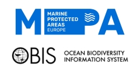
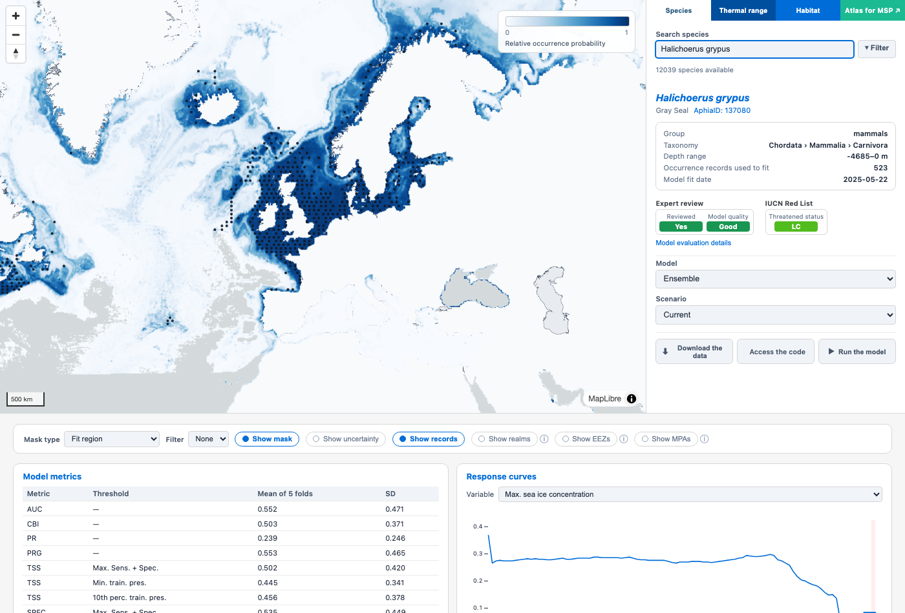
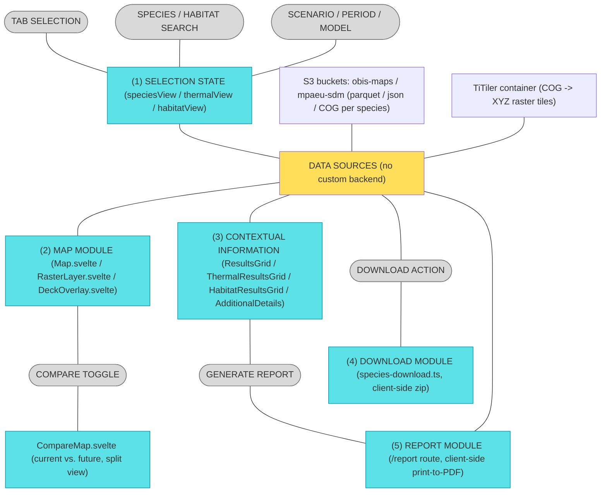

#  MPA Europe maps platform (static/Svelte rewrite)

This is a from-scratch **SvelteKit** rewrite of the [MPA Europe maps platform](https://shiny.obis.org/distmaps/) — the R/Shiny + Quarto application built by [OBIS](https://obis.org) to serve the Species Distribution Model (SDM) maps produced for the [MPA Europe project](https://mpa-europe.eu/). The original R application lives in a separate repository (`mpaeu_map_platform`) and is still the production app; this project reimplements its UI and behaviour as a **static site with no application backend**, talking directly to the same S3 data bucket and to a small [TiTiler](https://developmentseed.org/titiler/) container for raster tiles.

Below, a screenshot of the current status (Species tab, grey seal):



## Why a rewrite, and what changed

The R app is a single long-running Shiny process that holds reactive server-side state per user session, reads local files, and renders raster overlays with `leaflet`. This rewrite has **no server-side application logic at all**:

- The frontend is prerendered to plain static HTML/JS/CSS (`adapter-static`) and can be hosted anywhere that serves static files (this repo ships a GitHub Pages workflow).
- Every species/thermal/habitat/context/metrics file is fetched **directly from the public S3 bucket** the R app also reads from (`obis-maps`, plus the `mpaeu-sdm` bucket for the MPA boundary layer) — confirmed to allow anonymous, CORS-open reads.
- Raster COGs are **not** reprojected/tiled by the frontend — a single generic [TiTiler](https://github.com/developmentseed/titiler) container does that on request, given the COG's own HTTPS URL. It is the only "backend" this app has, and it is stateless and swappable.
- A few things the R app also does with a live R process (parsing an RDS file, rendering a Quarto report to HTML) are done **in the browser** instead: an R-to-WASM engine ([webR](https://docs.r-wasm.org/webr/latest/)) parses the one `.rds` file this app needs, and the species report is built as a plain Svelte route printed to PDF via the browser's own print dialog — no Quarto, no server render step.

Functional parity with the current live app is the goal for the **Species**, **Thermal range**, and **Habitat** tabs, and the **Atlas for MSP** entry (which, as in the original, is just a link to the separate [atlas.mpa-europe.eu](https://atlas.mpa-europe.eu/) site, not an internal tab). The **Diversity** tab is not implemented here either — it is already disabled in the current live R app (commented out in its `index.qmd`), so this is not a gap introduced by the rewrite. One feature — toggleable **MPA boundaries** (in addition to Realms/EEZs, which the R app already had) — is a genuinely new addition here, since the R app's own MPA checkbox was never wired up server-side.

## App architecture



There is no database and no application server: "(1)" through "(5)" above are just groups of Svelte components/modules running entirely in the visitor's browser, reacting to Svelte 5 rune-based stores. TiTiler is the one piece of infrastructure that must be deployed and kept running.

## Repository structure

```
src/
  routes/            SvelteKit pages (each becomes a prerendered static route)
  lib/components/    Svelte components
  lib/data/          Pure data-loading/parsing modules (no Svelte)
  lib/stores/        Shared reactive state (Svelte 5 runes, *.svelte.ts)
scripts/             One-off R data-prep scripts (not part of the build)
static/data/         Small static assets bundled with the site (species index, boundary layers)
```

### Routes (`src/routes/`)

- **`+layout.ts`** — sets `prerender = true`, `ssr = false`, `trailingSlash = 'always'` for the whole app (a pure static SPA build).
- **`+page.svelte`** — the real app: map + tabbed control panel (Species / Thermal range / Habitat), the shared "Extra Controls" strip (mask, Realms/EEZs/MPAs, compare toggle), and the contextual-results grid below.
- **`report/+page.svelte`** — the client-side species report (see "Report module" below). Reached via `?taxonid=&method=` query params, opened from the "Generate report" button on the Species tab.
- **`compare/+page.svelte`** and **`demo/+page.svelte`** — standalone demo/reference pages used while building the map infrastructure (split-view compare demo, generic multi-layer catalogue demo). Not linked from the main app's navigation.
- **`spike-titiler-check/+page.svelte`** — a throwaway page used to validate the TiTiler integration early on.

### Map components (`src/lib/components/maplibre/`)

- **`Map.svelte`** — thin wrapper around a `maplibregl.Map` instance; exposes it via Svelte context (`context.ts`) so children can add layers to it.
- **`RasterLayer.svelte`** — a native MapLibre raster source/layer backed by a TiTiler tile endpoint (`titiler-source.ts` builds the tile URL template, including colormap/rescale/mask parameters).
- **`DeckOverlay.svelte`** — a single deck.gl `MapboxOverlay` for vector data: polygon layers (`vector-layer-builder.ts`, streamed FlatGeobuf or GeoJSON — Realms/EEZs/MPAs) and point layers (`point-table-loader.ts` — species occurrence records read from a parquet file).
- **`CompareMap.svelte`** / **`compare-sync.ts`** — the "current vs. future" split-map viewer: two independent `maplibregl.Map` instances with synced camera movement and a draggable `clip-path`-based swipe divider (hand-rolled; see the file header for why the `@maplibre/maplibre-gl-compare` npm package wasn't used).
- **`titiler-source.ts`** — pure functions that build TiTiler tile/preview URLs (band selection, colormap, rescale domain, discrete/step colormaps, binary masks) and fetch band statistics.

### Species/Thermal/Habitat UI (`src/lib/components/species/`)

- **`TabBar.svelte`** — the Species / Thermal range / Habitat tabs, plus "Atlas for MSP" as an external link.
- **`SpeciesTab.svelte`** / **`ThermalTab.svelte`** / **`HabitatTab.svelte`** — each tab's search/select controls and context info box.
- **`SpeciesCombobox.svelte`** / **`SpeciesFilterModal.svelte`** — shared type-ahead search and the group/taxonomy/region filter modal (used by both Species and Thermal, which search the same species index independently).
- **`ExtraControls.svelte`** — the shared strip below the map (mask type/threshold/uncertainty, Realms/EEZs/MPAs toggles); tab-aware via a `variant` prop, mirroring which controls each tab in the original app actually exposes.
- **`ResultsGrid.svelte`** / **`ThermalResultsGrid.svelte`** / **`HabitatResultsGrid.svelte`** — the contextual-results grids below the map (model metrics, response curves, thermal range/density, habitat species list, etc.), one per tab.
- **`AdditionalDetails.svelte`** — the Species tab's expandable "Show additional details" section (spatial-bias envelope plots, SHAPE/MESS extrapolation maps, raw model-details JSON) plus the "Generate report" button.
- **`ResponseCurveChart.svelte`** / **`ThermalDensityChart.svelte`** / **`EnvelopeChart.svelte`** — chart components. The first two use [Observable Plot](https://observablehq.com/plot/) for hover tooltips; `EnvelopeChart` is a hand-rolled SVG chart (spatstat envelope plot, no equivalent Plot mark).
- **`ExpertReviewBox.svelte`** / **`ExpertEvalModal.svelte`** — expert-review/threatened-status badges and the peer-review detail modal.
- **`DownloadDataModal.svelte`** / **`DownloadCodeModal.svelte`** — the data-download (client-side zip) and "run the model locally" (templated notebook/Quarto file) modals.
- **`JsonViewer.svelte`** — a small recursive collapsible JSON tree, used for the raw model-details viewer.

### Data loaders (`src/lib/data/`)

Pure TypeScript modules, no Svelte — URL builders and parsers, one per data domain:

- **`species-catalogue.ts`** — URL builders for every per-species file (predictions, mask, thermal envelope, metrics, log, etc.) plus the scenario/period/model option lists.
- **`species-index-loader.ts`** — loads and caches the full species catalogue (`species-index.parquet`) and implements search/faceted filtering.
- **`species-metrics-loader.ts`** — parses `cvmetrics`/`varimportance`/`respcurves`/`thresholds` parquet files and `log.json` (unboxing R's `toJSON` scalar-array quirk).
- **`species-eval-loader.ts`** — expert-review/threatened-status data.
- **`species-download.ts`** — lists a species' files directly from S3 (`ListObjectsV2`) and builds client-side zip downloads (via [fflate](https://github.com/101arrowz/fflate)) plus the templated local-fit notebook.
- **`thermal-metrics-loader.ts`** / **`habitat-catalogue.ts`** / **`habitat-species-loader.ts`** — the Thermal range and Habitat tabs' own URL builders and metrics parsers.
- **`boundary-layers.ts`** — Realms/EEZ/MPA layer URLs, styling, and source-attribution text.
- **`report-data-loader.ts`** — parses the parts of `log.json` the species report needs beyond the context-info box (model details, per-algorithm results, post-evaluation stats).
- **`webr-bias-loader.ts`** — loads [webR](https://docs.r-wasm.org/webr/latest/) on demand and reads the one `.rds` file (`biasmetrics.rds`) this app needs, entirely client-side.
- **`layers.ts`** — the generic layer catalogue backing the `/demo` reference page (unrelated to the Species/Thermal/Habitat tabs).

### Stores (`src/lib/stores/`)

Svelte 5 rune-based reactive state (`*.svelte.ts`), one flat "current selection" object per tab rather than a layer stack — only one species/habitat renders at a time:

- **`speciesView.svelte.ts`** / **`thermalView.svelte.ts`** / **`habitatView.svelte.ts`** — each tab's selection state (species/habitat, scenario, period, model, mask, compare mode, etc.).
- **`mapOverlaysView.svelte.ts`** — the Realms/EEZs/MPAs toggle state, shared across all three tabs.
- **`activeLayers.svelte.ts`** — the generic layer-stack store backing `/demo`.

### Data prep scripts (`scripts/`)

Not part of the SvelteKit build — one-off/occasionally-rerun R scripts that produce the small static assets checked into `static/data/`:

- **`build-species-index.R`** — reproduces the R app's species-list loading logic and writes `static/data/species-index.parquet` (the full 12k+-species catalogue with model availability). Rerun if the upstream species list or model outputs change.
- **`convert-boundary-layers.R`** — converts the R app's local Realms/EEZ vector files to FlatGeobuf (`static/data/realms.fgb`, `static/data/eez.fgb`) for client-side streaming.

## Getting started

Requirements: Node.js 20+, and either a locally running TiTiler instance or Docker (to run one via `docker-compose.yml`).

```bash
npm install
cp .env.example .env   # PUBLIC_TITILER_URL — defaults to http://localhost:8000

# Start a local TiTiler instance (only needed once, keep it running):
docker compose up -d titiler

# Start the SvelteKit dev server:
npm run dev
```

Then open the printed local URL. Type-checking: `npm run check`.

## Building for production

```bash
npm run build      # prerenders the whole site into build/ (adapter-static)
npm run preview    # serve the production build locally
```

Two environment variables matter at build time (baked into the client bundle, not runtime-configurable afterwards):

- **`PUBLIC_TITILER_URL`** — the public URL of your TiTiler instance. Must be reachable from visitors' browsers, not just from your build machine.
- **`BASE_PATH`** — a URL subpath the site is served under (e.g. `/mpaeu_map_plat_static` for GitHub Pages project sites). Leave unset for a site served from a domain root.

## Deployment

- **Frontend**: any static file host works (the build output is plain HTML/CSS/JS). `.github/workflows/deploy.yml` builds and publishes to GitHub Pages on every push to `main` — set the `PUBLIC_TITILER_URL` repository variable (Settings → Secrets and variables → Actions → Variables) to your real TiTiler instance's public URL before relying on it; it otherwise defaults to `localhost`, which will not work for visitors.
- **TiTiler**: needs to run somewhere reachable over HTTPS from the frontend's visitors — any container host works. `docker-compose.yml`'s `titiler` service is a ready-to-use example (`ghcr.io/developmentseed/titiler`, CORS-open).

## Docker

`docker-compose.yml` defines two services:

- **`titiler`** — the generic raster-tiling backend, unmodified upstream image with CORS enabled and standard GDAL/rio-tiler tuning for reading remote COGs over HTTP range requests.
- **`frontend`** — a multi-stage build (`Dockerfile`): compiles the static site with Node, then serves it with a minimal `nginx:alpine` image (`nginx.conf` — plain static file serving, with a `404.html` fallback for unknown routes). No Node runtime is needed to *serve* the site, only to build it.

```bash
docker compose up -d
```

serves the full stack locally: the frontend on `http://localhost:8080` and TiTiler on `http://localhost:8000`. Pass `PUBLIC_TITILER_URL` as a build arg (`docker-compose.yml` already wires this from an env var of the same name) if TiTiler will be reachable at a different URL than `http://localhost:8000` once deployed.

## License

Licensed under [CC BY 4.0](https://creativecommons.org/licenses/by/4.0/) — see [LICENSE](LICENSE).
